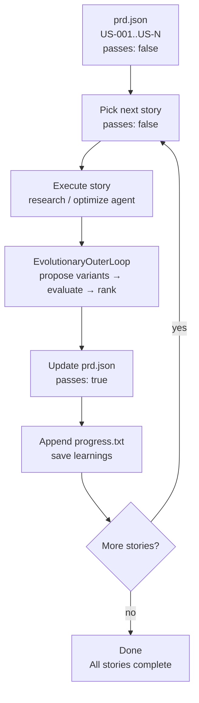
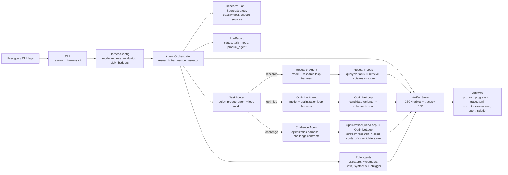
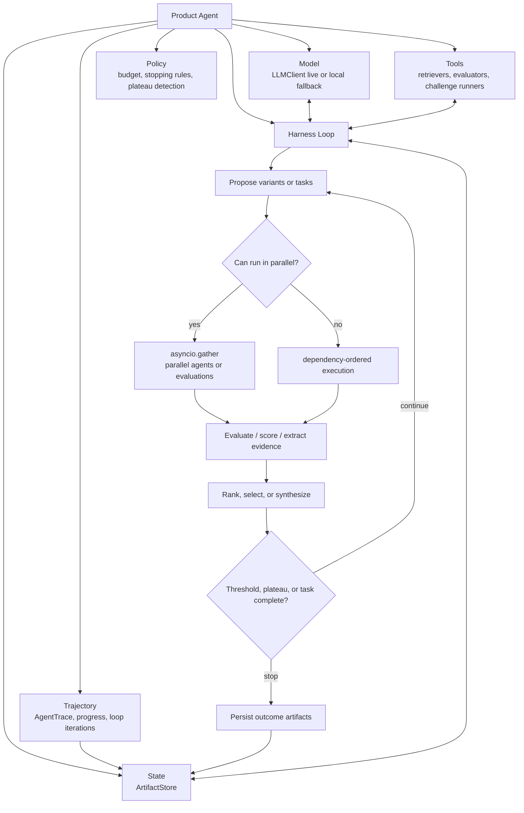
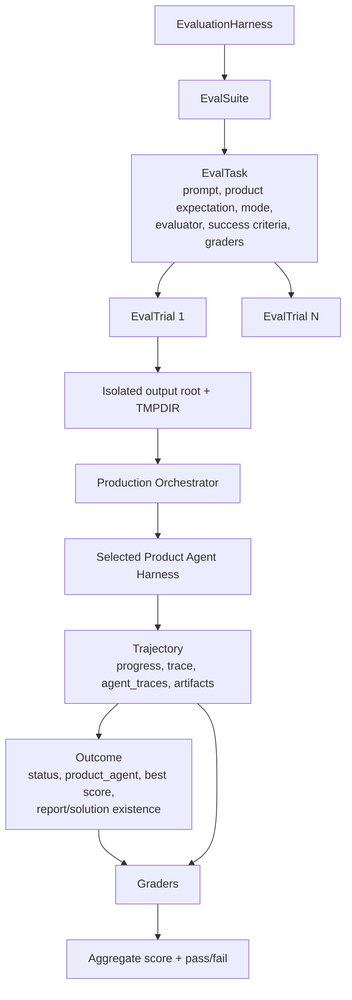

# Project Architecture

This project treats each product option as an agent in the conventional sense:

```text
agent = model + harness
```

The model is the inference component. The harness is the loop, tools,
evaluators, artifact store, budgets, traces, stopping rules, and orchestration
policy that make the model act on a task.

## Product Agents

There are three product agents:

| Product agent | Runtime loop mode | Primary objective |
| --- | --- | --- |
| `research` | `research` | Find papers/data, extract claims, synthesize grounded reports. |
| `optimize` | `optimize` or `optimize_query` | Improve a candidate against deterministic tests/evaluators. |
| `challenge` | `optimize_query` plus `optimize` | Solve benchmark/challenge tasks with proxy and official graders. |

`optimize` and `challenge` intentionally share the same optimization core. A
challenge is an optimization task with extra contract requirements: challenge
specs, solution rendering, optional official runner integration, and challenge
specific graders.

Every run writes a `prd.json`. The PRD records the selected product agent,
runtime mode, agent-harness definition, ordered tasks, acceptance criteria, and
artifact paths.

## Three-Loop Architecture

The harness runs three nested loops:

```text
Outer loop  — Session (sessions.py)
              Manages context isolation and parallel agent runs.
              Resets state between runs so each agent starts clean.

Middle loop — EvolutionaryOuterLoop (loops.py)
              Proposes and evaluates variants across N outer iterations.
              Drives research (query variants → retrieve → score) or
              optimize (code variants → evaluator → score).

Inner loop  — Ralph loop (orchestrator._run_loop + agent harness)
              The agent harness: model + loop policy + tools + store.
              Picks next story (passes: false) from prd.json.
              Executes it via research or optimization agent.
              Updates prd.json (passes: true) and appends progress.txt.
              Repeats until all stories pass or iteration budget exhausted.
```



## System Diagram

The visual architecture/roadmap diagram is available at
[`docs/assets/research_harness_architecture_phases_3_7.svg`](assets/research_harness_architecture_phases_3_7.svg).



## Agent Harness Internals



## Evaluation Harness

The evaluation harness runs the product agents as black-box systems and grades
their trajectories and outcomes.



## Product Agent Details

### Research Agent

```text
input goal
  -> route product_agent=research, loop_mode=research
  -> propose query variants
  -> run retrievers, possibly in parallel
  -> write sources and claims
  -> score evidence coverage/corroboration/credibility
  -> generate hypotheses
  -> critique contradictions
  -> synthesize final_report.md
```

### Optimize Agent

```text
input goal + evaluator
  -> route product_agent=optimize
  -> choose optimize or optimize_query loop
  -> propose candidate variants
  -> evaluate with deterministic evaluator/tests
  -> rank by score
  -> write optimized_candidate.txt, optimal_code.py, and optimization_result.json
```

### Challenge Agent

```text
input challenge goal + challenge evaluator
  -> route product_agent=challenge, loop_mode=optimize_query
  -> research challenge strategies
  -> write optimizer_seed_context.json
  -> propose candidate strategies
  -> evaluate local proxy
  -> render optimal_code.py for the selected strategy
  -> mirror to solution.py when a challenge adapter supports that upstream filename
  -> record official_result.measured=false until official runner executes
```

## Optimize And Challenge Relationship

`optimize` and `challenge` should stay fused at the loop/evaluator layer:

```text
Optimization core = propose candidates + evaluate + rank + stop + persist best
```

Challenge mode should remain a product-agent specialization:

```text
Challenge specialization = optimization core
  + challenge spec
  + proxy evaluator
  + optional official evaluator
  + solution renderer
  + challenge-specific graders
```

That keeps the implementation simple without erasing the product distinction
that matters to users and eval reporting.

## Optimization Output Contract

Every optimization or challenge run that executes an evaluator must write:

```text
optimized_candidate.txt
optimal_code.py
optimization_result.json
```

`optimization_result.json` must include `optimal_code_path`. Challenge-specific
artifacts such as `solution.py` are allowed, but they are additional artifacts,
not replacements for `optimal_code.py`.
