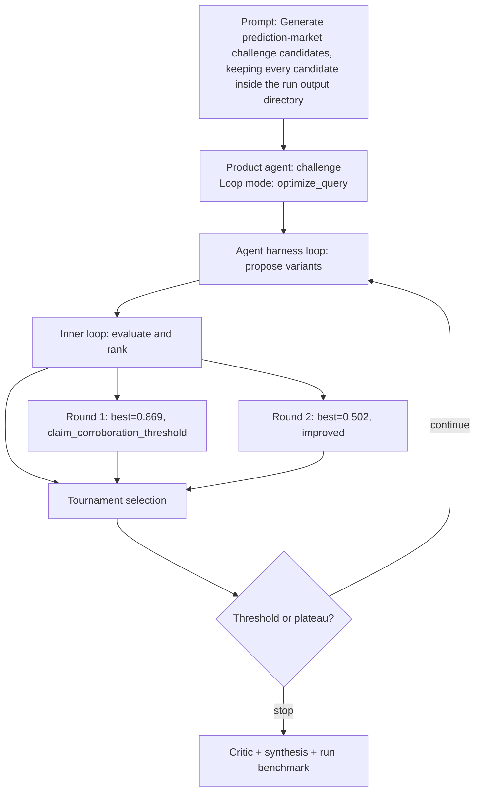

# Run Benchmark

- Run ID: `run_generate-prediction-market-challenge-candidates-keeping-every-candidate`
- Product agent: `challenge`
- Mode: `optimize_query`
- Tasks passed: 6 / 6
- Outer rounds: 2
- Variants evaluated: 7
- Best score: 0.869

## Decision DAG

## Round Summary
- Round 1: best `variant_af3f241ebc4d` score 0.869; signal `claim_corroboration_threshold`.
- Round 2: best `variant_f791784ac944` score 0.502; signal `improved`.
