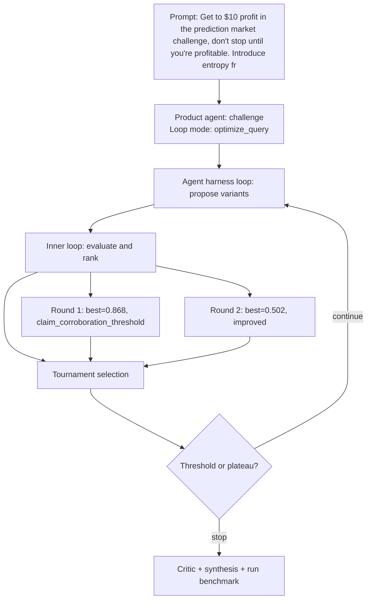

# Run Benchmark

- Run ID: `run_get-10-profit-prediction-market-challenge-don-t-stop-until-you-re-profit`
- Product agent: `challenge`
- Mode: `optimize_query`
- Tasks passed: 5 / 6
- Outer rounds: 2
- Variants evaluated: 7
- Best score: 0.868

## Decision DAG

## Round Summary
- Round 1: best `variant_b2cf81241fc8` score 0.868; signal `claim_corroboration_threshold`.
- Round 2: best `variant_a2d346028b37` score 0.502; signal `improved`.
