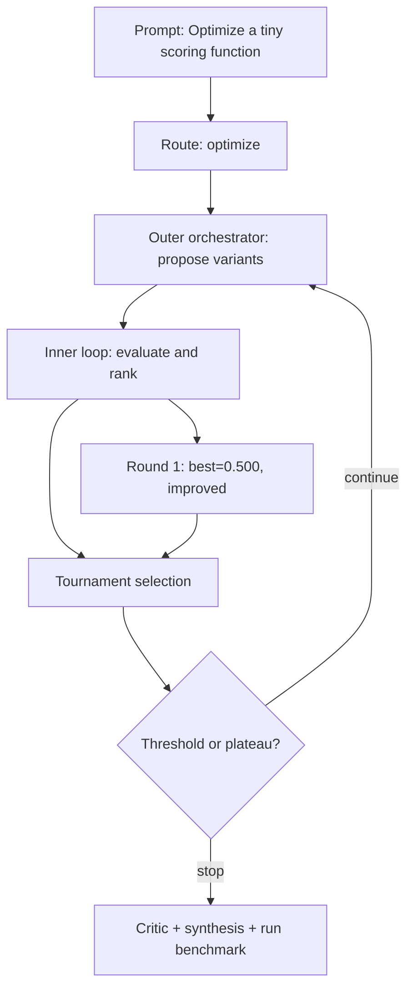

# Run Benchmark

- Run ID: `run_optimize-tiny-scoring-function`
- Mode: `optimize`
- Tasks passed: 4 / 4
- Outer rounds: 1
- Variants evaluated: 4
- Best score: 0.500

## Decision DAG

## Round Summary
- Round 1: best `variant_c3b316b78abc` score 0.500; signal `improved`.
