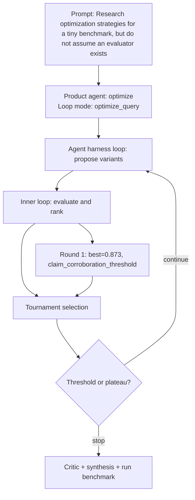

# Run Benchmark

- Run ID: `run_optimization-strategies-tiny-benchmark-but-do-not-assume-evaluator-exist`
- Product agent: `optimize`
- Mode: `optimize_query`
- Tasks passed: 6 / 6
- Outer rounds: 1
- Variants evaluated: 3
- Best score: 0.873

## Decision DAG

## Round Summary
- Round 1: best `variant_a053a99ffd25` score 0.873; signal `claim_corroboration_threshold`.
