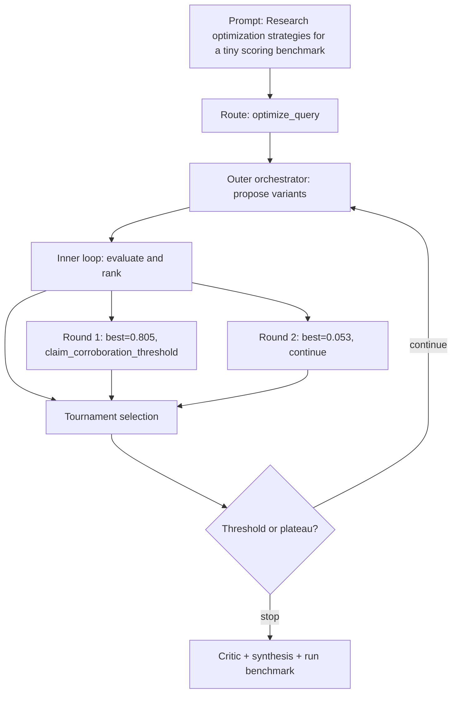

# Run Benchmark

- Run ID: `run_optimization-strategies-tiny-scoring-benchmark`
- Mode: `optimize_query`
- Tasks passed: 6 / 6
- Outer rounds: 2
- Variants evaluated: 7
- Best score: 0.805

## Decision DAG

## Round Summary
- Round 1: best `variant_c93f0cd62ada` score 0.805; signal `claim_corroboration_threshold`.
- Round 2: best `variant_8b1d117657c2` score 0.053; signal `continue`.
