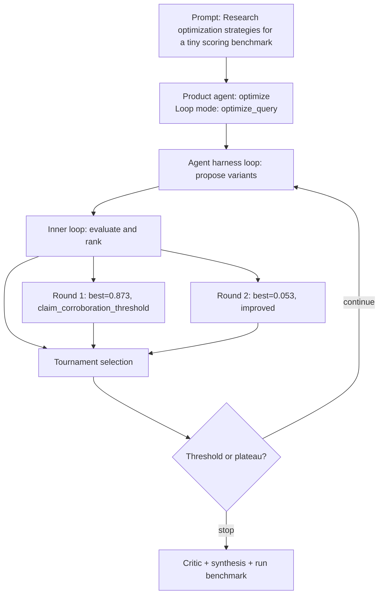

# Run Benchmark

- Run ID: `run_optimization-strategies-tiny-scoring-benchmark`
- Product agent: `optimize`
- Mode: `optimize_query`
- Tasks passed: 6 / 6
- Outer rounds: 2
- Variants evaluated: 7
- Best score: 0.873

## Decision DAG

## Round Summary
- Round 1: best `variant_834f7e7a06fa` score 0.873; signal `claim_corroboration_threshold`.
- Round 2: best `variant_366423cf8ad7` score 0.053; signal `improved`.
