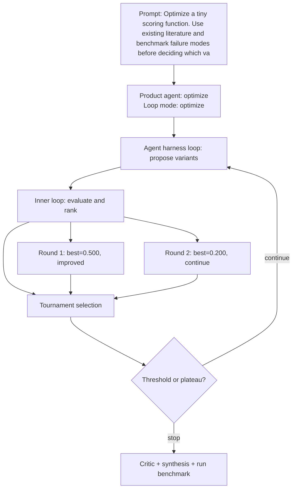

# Run Benchmark

- Run ID: `run_optimize-tiny-scoring-function-use-existing-literature-benchmark-failure`
- Product agent: `optimize`
- Mode: `optimize`
- Tasks passed: 4 / 4
- Outer rounds: 2
- Variants evaluated: 8
- Best score: 0.500

## Decision DAG

## Round Summary
- Round 1: best `variant_0a2559debc9c` score 0.500; signal `improved`.
- Round 2: best `variant_629fc858b1c4` score 0.200; signal `continue`.
