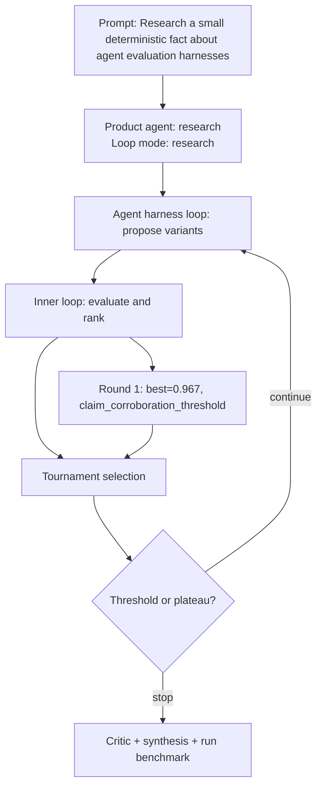

# Run Benchmark

- Run ID: `run_small-deterministic-fact-about-agent-evaluation-harnesses`
- Product agent: `research`
- Mode: `research`
- Tasks passed: 5 / 5
- Outer rounds: 1
- Variants evaluated: 4
- Best score: 0.967

## Decision DAG

## Round Summary
- Round 1: best `variant_8572c57db252` score 0.967; signal `claim_corroboration_threshold`.
