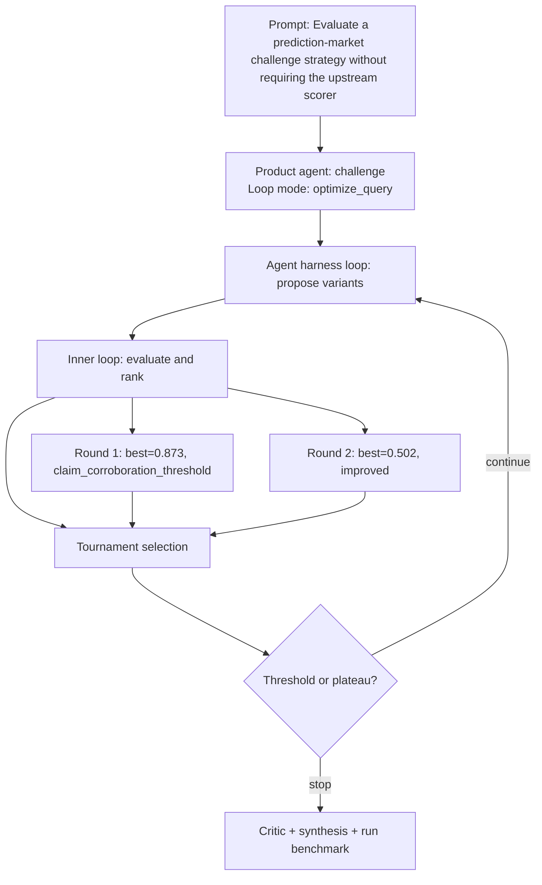

# Run Benchmark

- Run ID: `run_evaluate-prediction-market-challenge-strategy-without-requiring-upstream`
- Product agent: `challenge`
- Mode: `optimize_query`
- Tasks passed: 6 / 6
- Outer rounds: 2
- Variants evaluated: 7
- Best score: 0.873

## Decision DAG

## Round Summary
- Round 1: best `variant_12143b699a4a` score 0.873; signal `claim_corroboration_threshold`.
- Round 2: best `variant_70ca75105289` score 0.502; signal `improved`.
