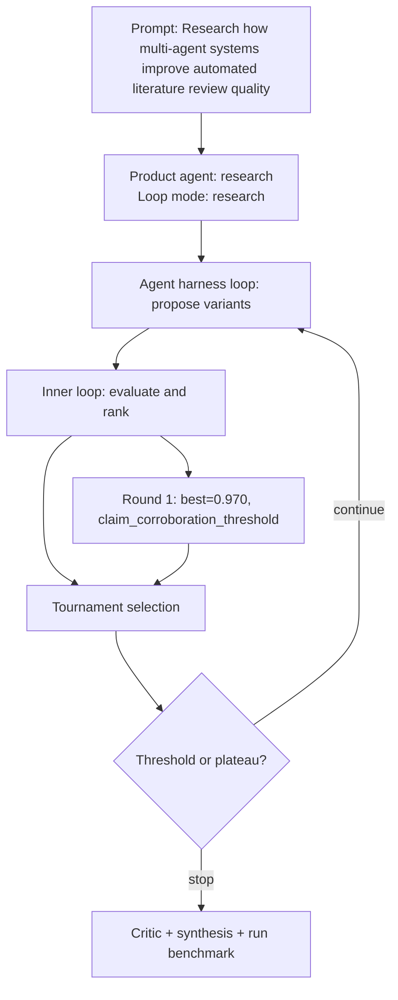

# Run Benchmark

- Run ID: `run_multi-agent-systems-improve-automated-literature-review-quality`
- Product agent: `research`
- Mode: `research`
- Tasks passed: 5 / 5
- Outer rounds: 1
- Variants evaluated: 4
- Best score: 0.970

## Decision DAG

## Round Summary
- Round 1: best `variant_bcd1d0f451f3` score 0.970; signal `claim_corroboration_threshold`.
