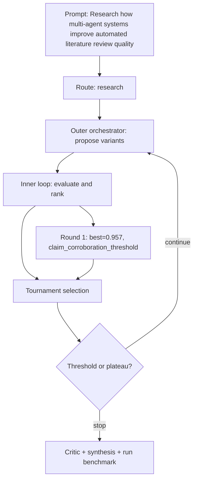

# Run Benchmark

- Run ID: `run_multi-agent-systems-improve-automated-literature-review-quality`
- Mode: `research`
- Tasks passed: 5 / 5
- Outer rounds: 1
- Variants evaluated: 3
- Best score: 0.957

## Decision DAG

## Round Summary
- Round 1: best `variant_5c856588b3ca` score 0.957; signal `claim_corroboration_threshold`.
