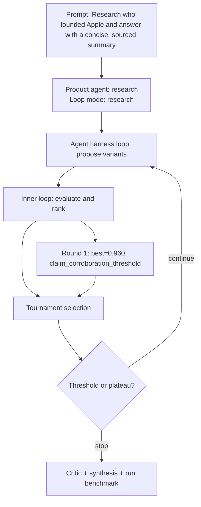

# Run Benchmark

- Run ID: `run_who-founded-apple-answer-with-concise-sourced-summary`
- Product agent: `research`
- Mode: `research`
- Tasks passed: 5 / 5
- Outer rounds: 1
- Variants evaluated: 1
- Best score: 0.960

## Decision DAG

## Round Summary
- Round 1: best `variant_f97207678010` score 0.960; signal `claim_corroboration_threshold`.
