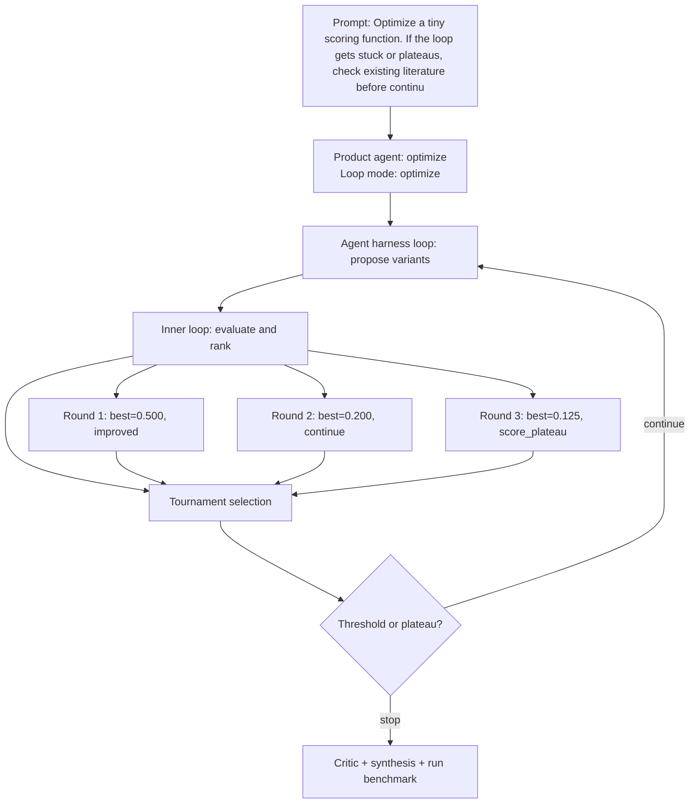

# Run Benchmark

- Run ID: `run_optimize-tiny-scoring-function-if-loop-gets-stuck-or-plateaus-check-exis`
- Product agent: `optimize`
- Mode: `optimize`
- Tasks passed: 4 / 4
- Outer rounds: 3
- Variants evaluated: 12
- Best score: 0.500

## Decision DAG

## Round Summary
- Round 1: best `variant_ffa88afe01ef` score 0.500; signal `improved`.
- Round 2: best `variant_7b880788b40b` score 0.200; signal `continue`.
- Round 3: best `variant_27040330f48c` score 0.125; signal `score_plateau`.
